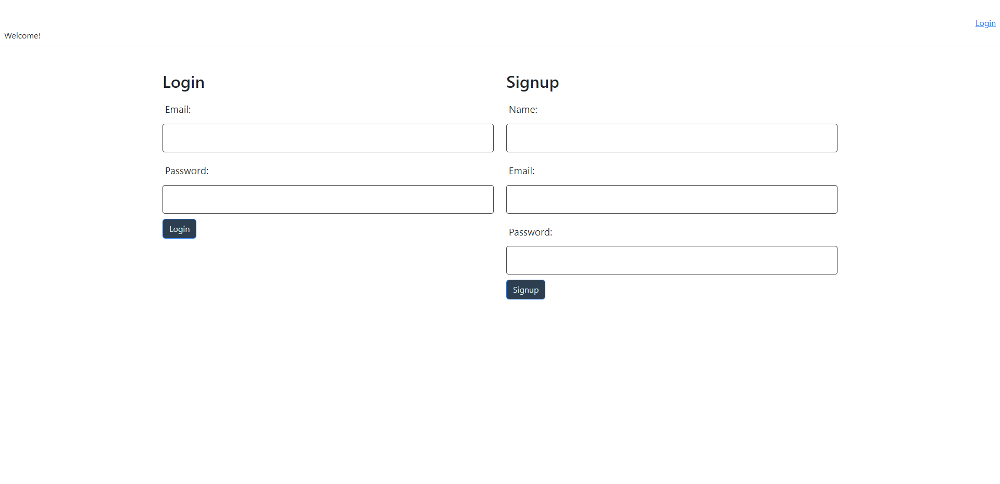

# Tech Blog

## Description

A simple blog webpage built with Handlebars.js and MySQL where users can create an account, blog posts, and comments on posts. Upon clone or download, run ```npm i``` in the root directory to install the necessary depencies followed by ```npm run start``` to launch a local server.


